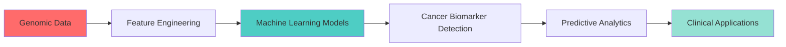

<p align="center">
  <a href="https://github.com/Zeshanhaiderraza">
    
  </a>
</p>

<h1 align="center">Hi 👋, I'm Zeshan Haider Raza</h1>
<h3 align="center">🧬 Bridging Biology and AI | Machine Learning in Genomics | Cancer Biomarker Discovery</h3>

<p align="center">
  
</p>


## 🔬 About Me

- 🧪 **Bioinformatician** specializing in **Genomics, Deep Learning & Big Data**
- 🎓 **MSc Bioinformatics** @ Teesside University, UK
- 🔭 Currently working on **Gene Expression Biomarkers for Cancer Detection**
- 🌱 Exploring **Machine Learning in Big Genomics Data**
- 💡 **2+ years** Research Associate experience in Genotoxicity & Cancer Research
- 📝 Published researcher with multiple peer-reviewed publications
- 👨‍🏫 Former **Lecturer** in Biotechnology & Molecular Biology
- ⚡ **Fun fact**: I combine wet lab expertise with computational power!

<br clear="right"/>

## 🧬 Research Focus
```python
research_interests = {
    "Primary": ["Machine Learning in Biology", "Cancer Genomics", "Predictive Modeling"],
    "Techniques": ["Deep Learning", "Gene Expression Analysis", "Quantitative Genetics"],
    "Applications": ["Biomarker Discovery", "Disease Prediction", "Animal Breeding"],
    "Goal": "Using AI to unlock genomic insights for precision medicine"
}
```

## 🛠️ Tech Arsenal

### 💻 Programming & Data Science
<p align="left">
  <a href="https://www.python.org/" target="_blank"></a>
  <a href="https://www.r-project.org/" target="_blank"></a>
  <a href="https://git-scm.com/" target="_blank"></a>
  <a href="https://github.com/" target="_blank"></a>
  <a href="https://www.linux.org/" target="_blank"></a>
  <a href="https://code.visualstudio.com/" target="_blank"></a>
</p>

### 🤖 Machine Learning & AI
<p align="left">
  <a href="https://scikit-learn.org/" target="_blank"></a>
  <a href="https://www.tensorflow.org/" target="_blank"></a>
  <a href="https://pytorch.org/" target="_blank"></a>
  <a href="https://keras.io/" target="_blank"></a>
</p>

### 📊 Data Analysis & Visualization
- **Libraries**: Pandas, NumPy, SciPy, Matplotlib, Seaborn, Plotly
- **Statistics**: Biostatistics, Experimental Design, Hypothesis Testing
- **Tools**: Minitab, SPSS, Excel Advanced

### 🧬 Bioinformatics Tools
- **Sequence Analysis**: MEGA, Bio-Edit, Chromas, PyMol
- **Genomics**: Genblast G, Primer3, BLAST, Multiple Sequence Alignment
- **Data**: GenBank, NCBI, Ensembl databases

### 🔬 Wet Lab Skills
- DNA/RNA Extraction | PCR (Conventional & Real-Time)
- Gel Electrophoresis | Gene Cloning
- Comet Assay | Caspase Assay | Oxidative Stress Analysis
- Spectrophotometry | Fluorescent Microscopy

## 📊 GitHub Stats

<p align="center">
  
  
</p>

<p align="center">
  
</p>

<p align="center">
  
</p>

## 🏆 GitHub Trophies
<p align="center">
  
</p>

## 📚 Featured Projects

<div align="center">

[](https://github.com/Zeshanhaiderraza/gene-expression-cancer-detection)
</div>

## 📈 Current Focus


## 🎓 Education Journey

| Degree | Institution | Year | Focus |
|--------|-------------|------|-------|
| 🎓 **MSc Bioinformatics** | Teesside University, UK | 2023-2025 | Gene Expression & Cancer Detection |
| 🎓 **MPhil Molecular Biology** | UVAS, Pakistan | 2016-2018 | Myostatin Gene Analysis |
| 🎓 **BSc Animal Sciences** | University of Sargodha | 2012-2016 | Genetics & Breeding |

## 📝 Publications

- 📄 **Polymorphic Status and Phylogenetic Analysis of Myostatin Gene in Pak-thoroughbred** (2020)
- 📄 **A Comprehensive Review on Genomic Diversity and Epidemiology of COVID-19** (2020)
- 📄 **In Silico Analysis of Putative Epitopes Out of BM86 Gene Sequences** (2023)

<p align="center">
  <a href="https://scholar.google.com/citations?user=qbp1T0YAAAAJ&hl=en">
    
  </a>
  <a href="https://www.researchgate.net/profile/Zeshan-Haider-Raza">
    
  </a>
</p>

## 🌐 Connect With Me

<p align="center">
  <a href="https://www.linkedin.com/in/zeshan-haider-raza-081673190" target="_blank">
    
  </a>
  <a href="mailto:shaniabg493@gmail.com" target="_blank">
    
  </a>
  <a href="https://scholar.google.com/citations?user=qbp1T0YAAAAJ&hl=en" target="_blank">
    
  </a>
  <a href="https://wa.me/447939555263" target="_blank">
    
  </a>
</p>

## 💼 Professional Experience

🔬 **Research Associate** | UVAS, Lahore (2019-2021)
- Genotoxicity & Cancer Assessment Research
- Heavy Metal Analysis in Biological Systems

👨‍🏫 **Lecturer** | Bahauddin Zakariya University (2021-2022)
- Advanced Biotechnology, Molecular Biology, Bioinformatics

🎓 **Trainee** | Moscow Institute of Physics & Technology (2020-2021)
- Applied Bioinformatics & Machine Learning

## 💡 What I'm Working On

- 🧬 Developing ML models for cancer biomarker identification
- 📊 Analyzing large-scale genomic datasets
- 🤖 Building bioinformatics pipelines with Python
- 📚 Contributing to open-source bioinformatics tools

## 📫 Get In Touch

💬 **Ask me about**: Bioinformatics, Machine Learning in Biology, Genomics, Python for Data Science

📧 **Email**: shaniabg493@gmail.com

📍 **Location**: Middlesbrough, United Kingdom

---

<p align="center">
  
</p>

<p align="center">
  
</p>

<p align="center">
  <i>⚡ "Stay curious, stay coding, stay scientific!" ⚡</i>
</p>
